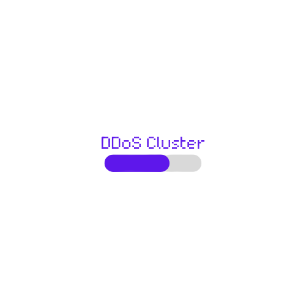

<!--lint disable awesome-list-item-->
<div align="center">
  <p align="center">
    
  </p>
  
  <h1>DDoS Cluster</h1>
  
  <p>
       :wrench: Run DDoS with NodeJS using the cluster module :rocket:
  </p>
  
  <a href="https://www.buymeacoffee.com/adriendeperetti" target="_blank"></a>
  
</div>

---

<div align="center">
  <a href="https://github.com/adrien2p/ddos_cluster/issues"></a>
  <a href="https://github.com/adrien2p/ddos_cluster/blob/main/LICENSE"></a>
  <a href="https://twitter.com/intent/tweet?text=Check%20this%20out!%20Run%20a%20DDoS%20attack%20in%20a%20NodeJS%20cluster&url=https://github.com/adrien2p/ddos_cluster"></a>
    
  </a>
</div>

# Getting started

Check your node version, it must be 17.6.0, otherwise you can use `nvm` as follow

```bash
nvm install 17
nvm use 17
```

#### Optional anonymisation

> The following steps are optional and only needed if you want to use the anonymisation

First, you need to install `Tor` on your machine since the requests will transit through
it in order to get anonymous requests.

```bash
# On Mac OS 
brew install tor
```

Or follow the link [here](https://tb-manual.torproject.org/installation/) or
[here](https://community.torproject.org/onion-services/setup/install/)

you can then find the configuration file located here (on mac os)
`/usr/local/etc/tor/torrc.sample`. You can remove the `.sample` to make it effective.

Finally, you can start your tor service

```bash
# On Mac OS
tor & # & make tor running as a background process
```

alternativaly, you can also install the [Tor browser](https://www.torproject.org/download/)

# Configuration

Start by populating `targets.json` with the websites you want to attack.
Here is how to fill the json file

````json
{
    "data": [
      "http://127.0.0.1:80"
    ]
}
````

Update the `config.json` file to customise the attack.
Here is the example `config.json`.

```json
{
    "requestPerBatch": 20,
	"logEveryMs": 150,
	"delayBetweenBatch": 500,
	"cpuUsageRatio": 1,
	"socksProxies": ["socks5h://127.0.0.1:9050"]
}
```

> The `socksProxies` configuration is optional and correspond to the anonymisation using TOR as explained
> in the [Getting started](#getting-started) section. It correspond to a set of Tor sockets
> that will be used as proxy for the requests.

# Running

## Tests

Run the following commands to be able to launch your servers and the DDoS attack on it.

```bash
npm run start-server:test
npm run start
```

this command `npm run start-server:test` will start a local sever on which you can try to
send some requests. Find your public IP and open a port on your router to redirect
the request to your local server. Then, add your public IP and port prefixed with
the protocol in `target.json` file.

## Production

To really start the attack, you only need to fill your `target.json` file with 
the websites you want to attack and eventually update your `config.json` file.
then run the command `npm run start` only.